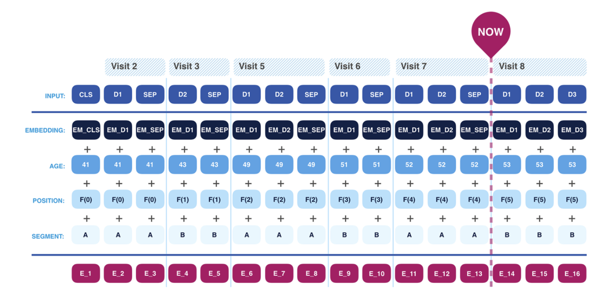

# EHR-BERT: Masked Token Learning for Inpatient Diagnosis and Procedure Prediction 

## Highlights



EHR-BERT is a project aimed at leveraging BERT (Bidirectional Encoder Representations from Transformers) for Electronic Health Records (EHR) data. BERT is an encoder-only transformer model that processes sequences of data by capturing context from both directions (left-to-right and right-to-left) simultaneously. This bidirectional capability allows it to understand the nuanced relationships within the data. In the context of EHR data, BERT is adapted to handle the unique structure of medical records, which include sequential visits, diagnoses, procedures, and patient information such as age and event positions.

EHR-BERT takes into account diagnoses, age, positional encodings for events, and segment encodings that differentiate between visits. These elements are combined to form a final embedding that represents the latent contextual information of a patient's EHR at any given visit.

## Contents

- [Project Structure](#project-structure)
- [CMS Data Summary](#cms-data-summary)
- [Usage](#usage)
  - [Install Dependencies](#install-dependencies)
  - [Download Data](#download-data)
  - [Preprocess Data](#preprocess-data)
  - [Run the Main Script](#run-the-main-script)
  - [Results](#results)
  - [TODO](#todo)
- [File Descriptions](#file-descriptions)

## Project Structure

```
├── cms_de10_data
├── data
│   ├── Bert-Pretraining
│   │   ├── bert_config.json
│   │   └── pytorch_model.bin
│   ├── combined_ip_claims.pkl
│   ├── data-comb-visit.pkl
│   ├── eval-id.txt
│   ├── test-id.txt
│   └── train-id.txt
├── download_data.sh
├── main.py
├── requirements.txt
├── src
│   ├── EHRBert
│   │   ├── bert.py
│   │   ├── bert_config.py
│   │   └── bert_pretrain.py
│   ├── ehr_dataset.py
│   ├── preprocess_ip_claims.py
│   └── utils.py
└── vocab
    ├── dx-vocab.txt
    └── proc-vocab.txt
```

## CMS Data Summary

Medicare Claims Synthetic Public Use Files (SynPUFs) provide a way to work with realistic Medicare claims data while protecting beneficiary privacy. The SynPUFs are similar in structure to CMS Limited Data Sets but with fewer variables, allowing users to develop programs and products that will work on actual CMS data files. These synthetic files include a robust set of metadata not available in the public domain.

Though limited in inferential research value, SynPUFs offer a timely and cost-effective way to access realistic data, fostering innovation and better care for Medicare beneficiaries. In this project, we use the 2008-2010 Data Entrepreneurs’ SynPUF, available for free download.

## Usage

### Install Dependencies
To install the required Python packages, run the following script:
```bash
pip install -r requirements.txt
```

### Download Data
Execute the following `download_data.sh` script to download and unzip the CMS data files into the `cms_de10_data` folder. Edit the shell script if you don't want to utilize the full sample of CMS data:
```bash
bash download_data.sh
```

### Preprocess Data
Run the `preprocess_ip_claims.py` script to pre-process the downloaded data for inpatient claims and create the ICD and PROC code vocab files:
```bash
python preprocess_ip_claims.py
```

### Run the Main Script
To train and evaluate the model, run the following `main.py` script and specify the parameters for training:
```bash
python main.py --model_name 'Bert-Pretraining' \
               --data_dir './data' \
               --pretrain_dir './data' \
               --train_file 'data-comb-visit.pkl' \
               --output_dir './data/Bert-Pretraining' \
               --do_train \
               --do_eval \
               --num_train_epochs 15 \
               --learning_rate 5e-4
```

### Results

| Metric                | Value      | Hyperparameters       |
|-----------------------|------------|-----------------------|
| Diagnosis PR-AUC      | ~80%       | `num_train_epochs=15`, `learning_rate=5e-4` |
| Procedure PR-AUC      | ~87%       | `num_train_epochs=15`, `learning_rate=5e-4` |

## TODO

- [ ] Use the pre-trained model for downstream re-admission prediction.

## File Descriptions

- `download_data.sh`: Script for downloading the necessary CMS data files.
- `preprocess_ip_claims.py`: Script to preprocess the raw claims data.
- `ehr_dataset.py`: Contains functions for dataset loading and preprocessing.
- `main.py`: Main script for training and evaluating the model.